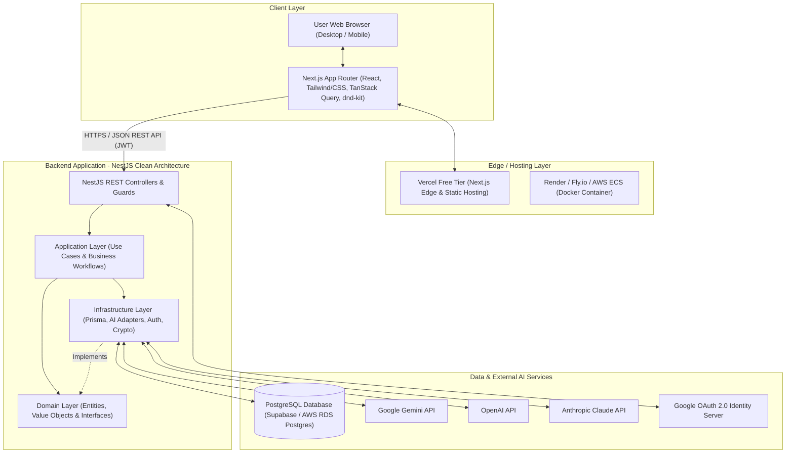
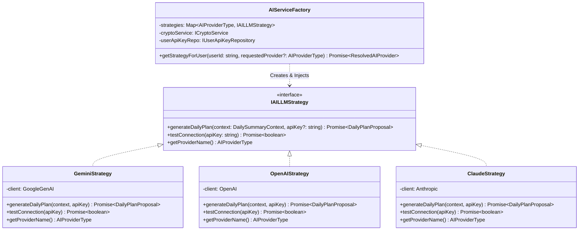
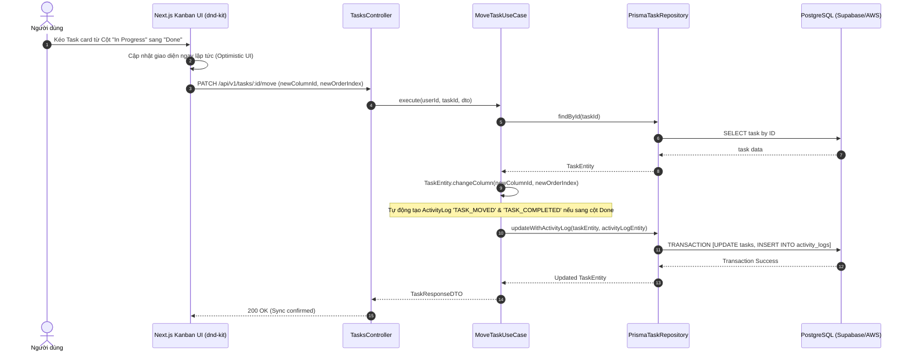
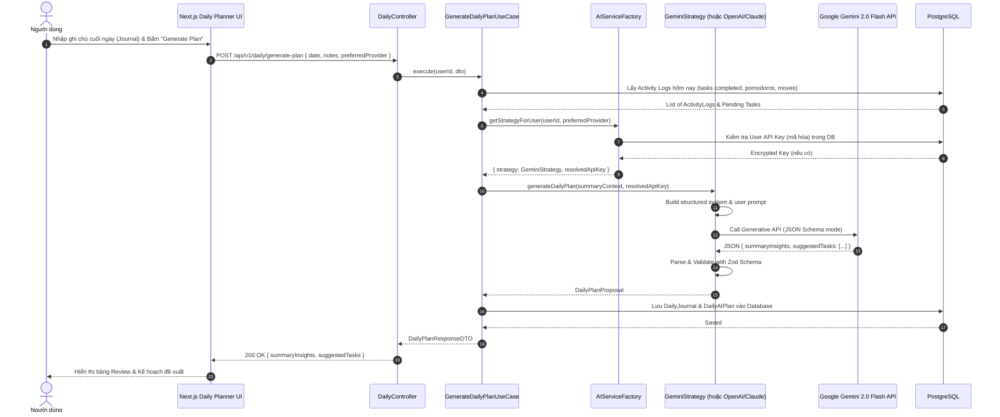

# System Architecture & Clean Architecture Blueprint
## Project: AI-Powered Personal Kanban & Intelligent Daily Planner

---

## 1. Tổng quan Kiến trúc Tổng thể (High-Level Architecture)

Hệ thống được thiết kế theo mô hình **Monorepo** hiện đại, tách biệt hoàn toàn giữa ứng dụng Giao diện người dùng (**Next.js Frontend**) và Máy chủ xử lý nghiệp vụ (**NestJS Backend**), giao tiếp qua **RESTful API** bảo mật bằng **JWT Token**.



---

## 2. Chi tiết 4 Tầng Clean Architecture (Backend NestJS)

Backend áp dụng nguyên lý **Dependency Inversion Principle (DIP)**: Tầng bên ngoài phụ thuộc vào tầng bên trong; Tầng bên trong (Domain) hoàn toàn không biết gì về cơ sở dữ liệu, framework hoặc dịch vụ bên ngoài.

```
apps/api/src/
├── domain/                      # [TẦNG 1: DOMAIN LAYER - CORE BUSINESS RULES]
│   ├── entities/                # Thực thể nghiệp vụ thuần TypeScript (không phụ thuộc Prisma)
│   │   ├── user.entity.ts
│   │   ├── board.entity.ts
│   │   ├── column.entity.ts
│   │   ├── task.entity.ts
│   │   ├── subtask.entity.ts
│   │   ├── activity-log.entity.ts
│   │   ├── daily-journal.entity.ts
│   │   └── daily-plan.entity.ts
│   ├── value-objects/           # Value Objects bất biến (Priority, TaskStatus, TimeRange)
│   ├── repositories/            # Repository Interfaces (Hợp đồng dữ liệu)
│   │   ├── user.repository.interface.ts
│   │   ├── board.repository.interface.ts
│   │   ├── task.repository.interface.ts
│   │   ├── activity-log.repository.interface.ts
│   │   └── daily-plan.repository.interface.ts
│   └── services/                # Domain Services & AI Provider Interfaces
│       └── ai-llm-strategy.interface.ts
│
├── application/                 # [TẦNG 2: APPLICATION LAYER - USE CASES]
│   ├── use-cases/               # Mỗi Use Case là 1 class đơn nhiệm (Single Responsibility)
│   │   ├── auth/                # LoginWithGoogleUseCase, RefreshTokenUseCase
│   │   ├── boards/              # CreateBoardUseCase, GetBoardDetailsUseCase, ReorderColumnsUseCase
│   │   ├── tasks/               # CreateTaskUseCase, UpdateTaskUseCase, MoveTaskUseCase, LogPomodoroUseCase
│   │   ├── daily/               # GetTodaySummaryUseCase, SaveDailyJournalUseCase
│   │   └── ai-planner/          # GenerateDailyPlanUseCase, ApplyDailyPlanUseCase
│   ├── dtos/                    # Input DTOs & Output DTOs cho các Use Cases
│   └── ports/                   # Interfaces cho các service phụ trợ (ICryptoService, ITokenService)
│
├── infrastructure/              # [TẦNG 3: INFRASTRUCTURE LAYER - ADAPTERS & DRIVERS]
│   ├── database/                # Prisma ORM Implementation
│   │   ├── prisma.service.ts
│   │   ├── repositories/        # PrismaTaskRepository implements ITaskRepository
│   │   └── mappers/             # Chuyển đổi qua lại giữa Prisma Model và Domain Entity
│   ├── ai/                      # AI Subsystem (Design Patterns)
│   │   ├── ai-service.factory.ts
│   │   ├── strategies/          # GeminiStrategy, OpenAIStrategy, ClaudeStrategy
│   │   └── adapters/            # PromptAdapter, ResponseParserAdapter
│   ├── security/                # CryptoService (Mã hóa AES-256-GCM cho User API Keys)
│   └── auth/                    # Passport Google Strategy, JwtTokenService
│
└── presentation/                # [TẦNG 4: PRESENTATION LAYER - HTTP REST API]
    ├── controllers/             # AuthController, BoardsController, TasksController, DailyController
    ├── guards/                  # JwtAuthGuard, ResourceOwnerGuard
    ├── interceptors/            # LoggingInterceptor, ResponseTransformInterceptor
    ├── filters/                 # GlobalExceptionFilter
    └── dtos/                    # Swagger / Validation Request DTOs (Class-Validator)
```

---

## 3. Design Patterns ứng dụng chi tiết

### 3.1. Strategy Pattern cho AI Subsystem
- **Mục đích**: Cho phép hệ thống tương tác với nhiều nhà cung cấp LLM khác nhau (Google Gemini, OpenAI GPT, Anthropic Claude, DeepSeek...) mà không làm thay đổi logic lập kế hoạch của tầng Application.
- **Cấu trúc**:
  - `IAILLMStrategy`: Interface định nghĩa phương thức `generateDailyPlan(context: DailySummaryContext, userApiKey?: string): Promise<DailyPlanProposal>`.
  - `GeminiStrategy`: Hiện thực gọi Google Generative AI SDK / REST API.
  - `OpenAIStrategy`: Hiện thực gọi OpenAI Chat Completions API (hỗ trợ Structured Outputs).
  - `ClaudeStrategy`: Hiện thực gọi Anthropic Messages API.



### 3.2. Factory Pattern (AIServiceFactory)
- **Cơ chế hoạt động**:
  1. Use Case `GenerateDailyPlanUseCase` yêu cầu `AIServiceFactory` cung cấp provider cho `userId`.
  2. `AIServiceFactory` kiểm tra xem người dùng có cấu hình Custom API Key trong DB (đã giải mã qua `CryptoService`) hay không.
  3. Nếu có, sử dụng Strategy tương ứng với Custom Key.
  4. Nếu không, fallback về System Default API Key (đọc từ biến môi trường `GEMINI_API_KEY` hoặc `OPENAI_API_KEY`).

### 3.3. Adapter Pattern (Prompt & Response Parsing)
- Chuẩn hóa format prompt: Tổng hợp Activity Logs, Pomodoro Stats, Task trạng thái dở dang và Journal của người dùng thành Prompt đồng nhất.
- Parse và validate output JSON từ LLM thành Entity `DailyPlanProposal` để đảm bảo không bao giờ bị lỗi format khi lưu vào DB hoặc gửi về Frontend.

### 3.4. Repository Pattern & Mapper Pattern
- Tách biệt hoàn toàn `TaskEntity` (Domain) và `Task` (Prisma Database Model).
- `TaskMapper.toDomain(prismaTask)` và `TaskMapper.toPersistence(taskEntity)` đảm bảo tính toàn vẹn và bất biến của Domain Entity.

---

## 4. Sequence Diagrams (Luồng xử lý cốt lõi)

### 4.1. Luồng Kéo thả Task & Ghi nhận Activity Log (Move Task Flow)



### 4.2. Luồng AI Thu thập dữ liệu & Lập kế hoạch ngày mai (AI Daily Plan Flow)



---

## 5. Khả năng Mở rộng trong Tương lai (Future Extensibility)

Nhờ tuân thủ **Clean Architecture** và các **Design Patterns**, hệ thống có thể mở rộng dễ dàng:
1. **Thêm LLM Provider mới (ví dụ DeepSeek R1, Mistral, Ollama)**:
   - Chỉ cần tạo file `src/infrastructure/ai/strategies/deepseek.strategy.ts` implement `IAILLMStrategy` và thêm enum `DEEPSEEK` vào `AIProviderType`. Toàn bộ Use Cases và UI không cần thay đổi cấu trúc!
2. **Tích hợp Notification / Webhooks (Slack, Telegram, Discord)**:
   - Thêm `INotificationPort` trong Application Layer và triển khai `TelegramNotifierAdapter` trong Infrastructure Layer.
3. **Chuyển đổi Database (Supabase -> AWS Aurora / Neon / Local Postgres)**:
   - Chỉ cần cập nhật biến môi trường `DATABASE_URL` trong file `.env`, không cần sửa bất kỳ dòng code logic nào.
